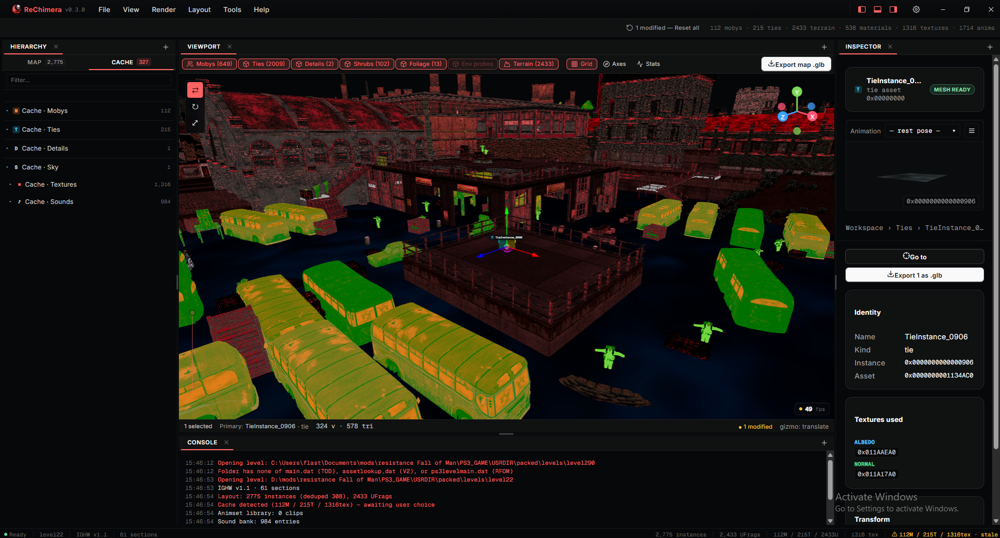
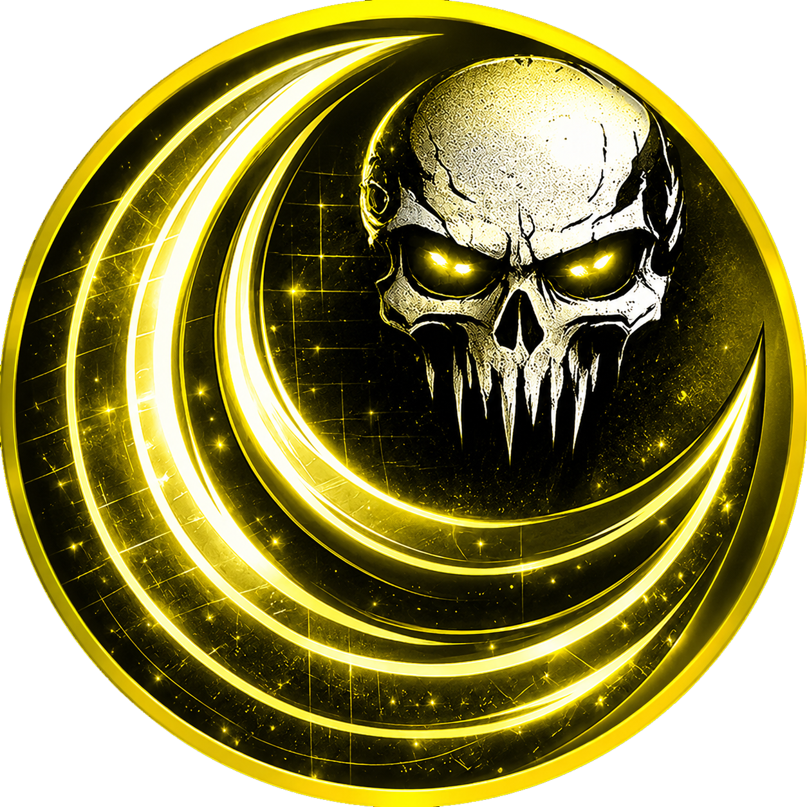

<p align="center">
  
</p>

<h1 align="center">ReChimera</h1>

<p align="center">
  <strong>Offline level inspector and asset extractor for Insomniac Games' PS3 titles</strong><br/>
  <sub>Resistance: Fall of Man · Resistance 2 · Resistance 3 · Ratchet &amp; Clank: Tools of Destruction · A Crack in Time · All 4 One</sub>
</p>

<p align="center">
  <a href="LICENSE"></a>
  <a href="https://github.com/Mrroboto9819/ReChimera/releases"></a>
</p>



---

ReChimera loads a level folder, decodes its meshes / textures / skeletons / animations / sound banks, and lets you preview and export them through a desktop UI. **Use it on game files you legally own.** No game data is shipped.

Deep documentation lives in [`docs/`](docs/) and inside the running app under **Help → Documentation**.

## Download

Two release channels, both auto-updating on Windows:

| |  &nbsp;**Stable**  |  &nbsp;**Canary** |
|---|---|---|
| Built from | `main` | `develop` |
| Cadence | tagged releases when something's ready to ship | every push to `develop` |
| Use it when | you want a build you can rely on | you want to test in-flight work / new game support before it lands in stable |
| Bundle identifier | `dev.rechimera.desktop` | `dev.rechimera.desktop.canary` |
| Title bar | red wordmark | yellow wordmark |
| **Download** | **[Latest stable release →](https://github.com/Mrroboto9819/ReChimera/releases/latest)** | **[Latest canary builds →](https://github.com/Mrroboto9819/ReChimera/releases?q=canary&expanded=true)** |

Stable and canary **install side-by-side** — different identifiers, different settings stores, different icons. You can run both on the same machine to compare behavior. Each channel auto-updates independently: stable updates only when a new stable releases, canary updates on every push to `develop`. macOS / Linux users replace the binary manually.

> ⚠️ Canary is bleeding edge — expect breakage. File issues with the full version string (e.g. `0.4.0-15`) so we can pin which build broke.

## Use

1. Pick a channel from **[Download](#download)** above and install it.
2. Extract every `.psarc` that ships with your level into a single folder (use any PSARC extractor, or the wizard's built-in **Extract a PSARC** step).
3. Point ReChimera at that folder — it auto-detects the engine era from the layout marker (`assetlookup.dat`, `ps3levelmain.dat`, or `main.dat`).

Missing PSARC siblings don't crash the loader — they show up as `no audio` badges or empty meshes.

## Build from source

Requires **Rust 1.75+** (Edition 2021), **[Bun](https://bun.sh)** (or `npm 10+`), and **WebView2** on Windows (preinstalled on Win11).

```sh
cd apps/desktop
bun install

bun run tauri:dev      # dev window with hot-reload
bun run tauri:build    # installers into src-tauri/target/release/bundle/
```

## Acknowledgements

ReChimera builds on years of community reverse-engineering on Insomniac's PS3 engine. None of this would exist without the people and projects below.

**People**
- **[@VELD-Dev](https://github.com/VELD-Dev)** — author and current maintainer of [ReLunacy](https://github.com/VELD-Dev/ReLunacy), the C# / Unity predecessor that ReChimera's core parser approach ports from.
- **[@NefariousTechSupport](https://github.com/NefariousTechSupport)** — original developer of Lunacy and one of the key reverse engineers for these titles. The renderer is directly inspired by [7th igRewrite](https://github.com/NefariousTechSupport/7thigRewrite).
- **[@PredatorCZ](https://github.com/PredatorCZ)** — author of [InsomniaToolset](https://github.com/PredatorCZ/InsomniaToolset) and the [Spike framework](https://github.com/PredatorCZ/Spike). Many section IDs, struct layouts, and the RFOM `levelmain` decode path here come from cross-referencing their headers.
- **[@Nooga](https://github.com/Nooga)** — artist behind ReLunacy's logo, which set the visual identity this project follows.

**Reference projects**
- [ReLunacy / LibLunacy](https://github.com/VELD-Dev/ReLunacy) (GPL-3.0) — C# / Unity predecessor; canonical reference for the V2 path (R2 / R3 / RCF / A4O / ACiT) and TOD moby / tie decode.
- [InsomniaToolset](https://github.com/PredatorCZ/InsomniaToolset) (GPL-3.0) — canonical reference for the IGHW container, RFOM `levelmain` extract, foliage / shrub / animation decode, and the V2 glTF emit pipeline.
- [Spike framework](https://github.com/PredatorCZ/Spike) (BSD-3-Clause).
- [7th igRewrite](https://github.com/NefariousTechSupport/7thigRewrite).

## License

**GPL-3.0-or-later** — see [LICENSE](LICENSE) and [NOTICE.md](NOTICE.md). The licence is dictated by upstream: InsomniaToolset and ReLunacy / LibLunacy are GPL-3.0, and that propagates into derivative works.
